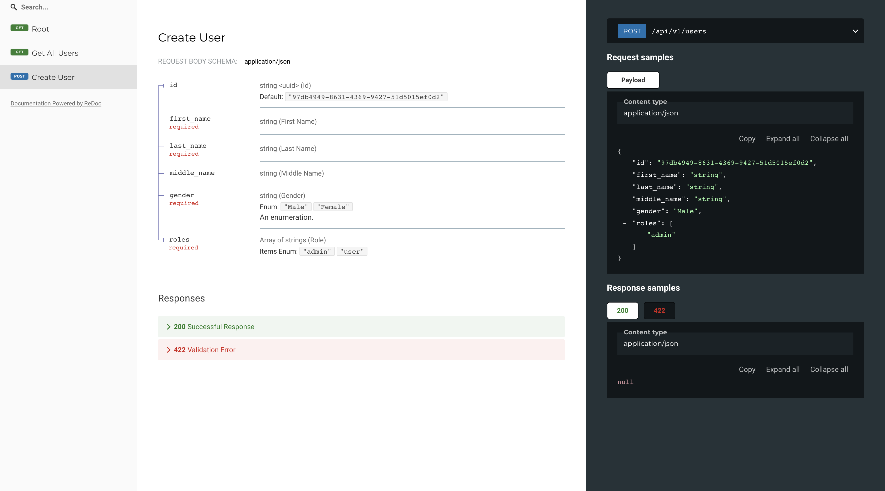

## My FastAPI

### About 
`My FastAPI` in a Web service api, was created using `fastapi` 

to run this Project simply clone it through this Repository by copying this line below.

```git clone https://github.com/ivandi1980/my-fastapi.git```

### Installation
Make sure you already have `Python` installed in your computer.

you can use `pip` to install any dependencies and you've to creating `environment` in your computer.

### Running The Program without Docker
To run this program after you finish installing all of the dependencies, just simply typing :
`uvicorn main:app --reload`

### Dockerizing Your FastAPI Project
```
FROM python:3.9.12-slim

RUN pip install fastapi uvicorn poetry wheel virtualenv

EXPOSE 8000

WORKDIR /usr/src/my-fastapi

ENV PORT 8000
ENV HOST "0.0.0.0"
COPY ./src/ /my-fastapi/src
COPY ./main.py /my-fastapi
COPY ./pyproject.toml /my-fastapi

WORKDIR /my-fastapi
RUN poetry config virtualenvs.create false \
  && poetry install

CMD ["uvicorn", "main:app"]
```
To build locally, run the following with the desired image name for your project:

`docker build -t myfastapi -f Dockerfile .`

If your machine is running with the Apple Silicon chip, run the following instead to prevent issues with AWS Fargate and Heroku (to name a few):

`docker build --platform linux/amd64 -t myfastapi -f Dockerfile .`

### Running The Program inside Docker 
just typing :
`docker run --name myfastapi -p 8000:8000 myfastapi`

That's it


#### My FastAPI Captured



<hr />
`This Documentation would be update soon!`